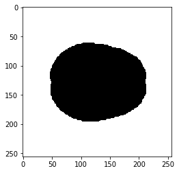
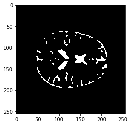
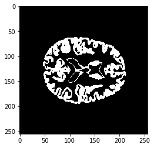
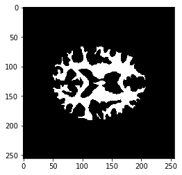
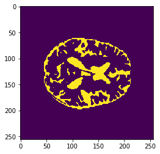

# UNET_Segmentation

Segmentation of MRI images using UNET

## Requirements:
  * Python >= 3.5
  * Keras

## Segmentation of MRI Images

**MRI Image and it's corresponding Segmented Image**      
      

**One hot encoding of the Masks**

      

**UNET Architecture**
Using the UNET model to do the segmentation.
UNET is an Autoencoder with skip connections.

**Segmented Image Prediction**

**Prediction**

**Actual Segmented Image**

**Loss & Accuracy curves**

           

