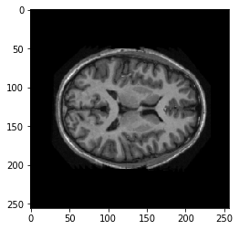

# UNET_Segmentation

**Segmentation of MRI Images**

**MRI Image and it's corresponding Segmented Image**      
      

**UNET Architecture**
Using the UNET model to do the segmentation.
UNET is an Autoencoder with skip connections.

